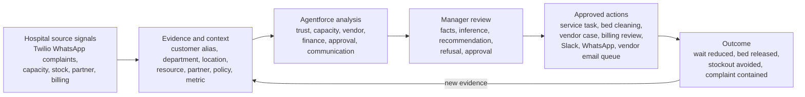
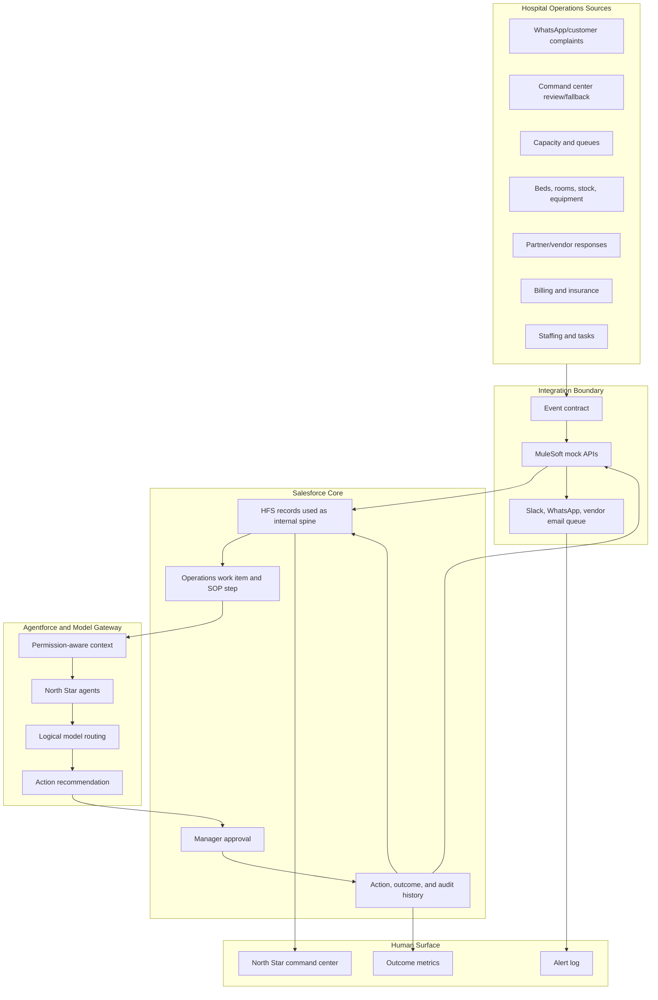

# System Architecture

## Product Mental Model

North Star turns scattered business signals into approved operational actions
and measurable outcomes. The active demo profile is private hospital
operations, built on universal primitives that can also map to hotels, airports,
banking, retail, cruise, and other sectors.

The key rule is simple: agents can recommend, explain, draft, and request
approval. Consequential external actions require manager approval and an
auditable action boundary. Clinical diagnosis, treatment, dosage, triage, and
clinical priority decisions are outside the demo.

## North Star Flow

1. A hospital operations signal arrives from Twilio WhatsApp inbound, a
   synthetic complaint, capacity, resource, partner, billing, stock, or staffing
   source. The Salesforce command center remains the visibility, audit, and
   fallback approval surface.
2. The event contract validates the envelope, hash, idempotency key, sequence,
   and correlation ID.
3. The source payload maps into Salesforce context records for global
   primitives: signal, evidence, customer alias, department, location, resource,
   partner, policy, recommendation, approval, action, outcome, and metric.
4. Agentforce receives only the context the current user and purpose can access.
5. Specialist agents analyze evidence, patient trust, capacity, partner/vendor,
   financial impact, risk/approval, communication, and outcome implications.
6. The orchestrator produces one evidence-backed action plan.
7. The manager approves, rejects, modifies, or defers protected actions.
8. MuleSoft mocks execute approved write-backs and channel alerts.
9. Outcome events return through the same intake path and refresh the command
   center.

## Runtime Components

## Storage Responsibilities

| Component       | Responsibility                                                                   |
| --------------- | -------------------------------------------------------------------------------- |
| Source fixtures | Synthetic hospital records and event payloads                                    |
| MuleSoft mocks  | Intake, validation, write-back simulation, channel results, retry behavior       |
| Salesforce Core | Work item, evidence, recommendation, approval, action, outcome, and audit record |
| Model gateway   | Logical model profile, routing, validation, fallback, and invocation audit       |
| Agentforce      | Explanation, recommendation drafting, approval request, and governed refusal     |
| Lightning       | Command center, evidence timeline, approval cockpit, alert log, outcome view     |

## Current Repository State

The repo already contains a reusable governed spine: Salesforce metadata,
service contracts, event schemas, MuleSoft mocks, model-gateway fixtures,
Agentforce contracts, a Lightning command center, Slack action support, and
harness scripts.

The next work is hospital-profile specialization: hospital fixtures, hospital
labels, North Star Agentforce topics, approved mock write-backs, WhatsApp-style
alert results, clinical-refusal scenarios, and a polished command-center demo.
