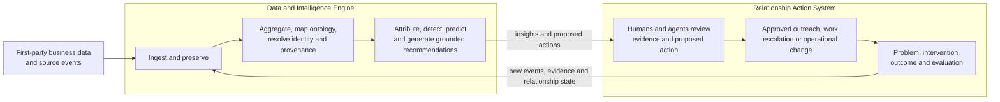
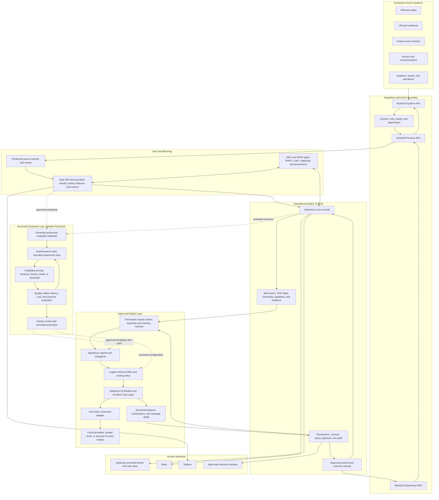

# System Architecture

## Product Mental Model

At product level, the system is two coupled loops:

Here, data manipulation means governed transformation, aggregation, mapping,
and inference. It does not mean covert behavioral manipulation. Personalization
and predictions remain bounded by source evidence, consent, purpose, access
policy, model policy, and the configured human approval point.

## Current Intended Architecture

## Runtime Flow

1. MuleSoft receives a source event, validates it, preserves the source
   record, and applies retry and replay controls.
2. Data 360 harmonizes the event, resolves identity, calculates defined
   measures, and retains history.
3. The semantic layer defines what records and relationships mean and validates
   required provenance.
4. Salesforce Core creates or updates the operational work item, SOP execution,
   evidence, owner, deadline, and affected relationships.
5. Agentforce receives only the context the current user and purpose are
   permitted to access.
6. A logical model profile selects an approved model deployment without
   exposing provider-specific names to business logic.
7. The model produces an explanation, recommendation, or draft. Deterministic
   code validates its shape, citations, permissions, and applicable policy.
8. A human approves, rejects, or modifies consequential actions.
9. MuleSoft writes the approved action to the authoritative source system.
10. The resulting outcome event returns through the same ingestion path and is
    attached to the decision trace.

## Storage Responsibilities

| Component       | Responsibility                                                                             |
| --------------- | ------------------------------------------------------------------------------------------ |
| Source systems  | Authoritative operational source records                                                   |
| MuleSoft        | Source-specific connectivity, validation, orchestration, retries, and write-back           |
| Data 360        | Harmonization, identity, event history, calculated insights, and model features            |
| Salesforce Core | Current operational work, SOP execution, recommendations, approvals, actions, and outcomes |
| Ontology files  | Versioned meaning, mappings, provenance requirements, and validation rules                 |
| Model providers | Inference only; they are not the system of record                                          |
| Evaluation lab  | Isolated experiments and candidate configurations, never live enterprise actions           |

## Current Repository State

The architecture and roadmap exist, but the product runtime has not yet been
scaffolded. The next executable work is the Salesforce DX skeleton, event
contracts, and initial ontology.
