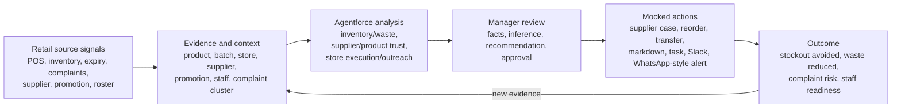
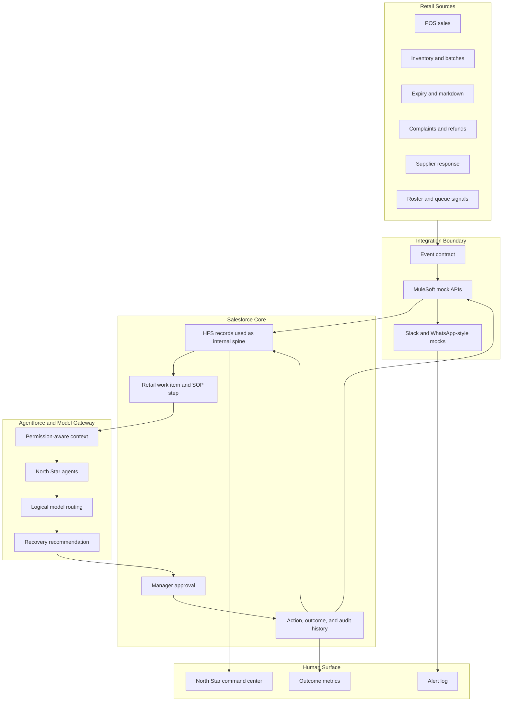

# System Architecture

## Product Mental Model

North Star turns scattered supermarket signals into approved operational
actions.

The key rule is simple: agents can recommend, explain, draft, and request
approval. Consequential external actions require manager approval and an
auditable action boundary.

## North Star Flow

1. A retail event arrives from a synthetic POS, inventory, expiry, complaint,
   supplier, promotion, or staffing source.
2. The event contract validates the envelope, hash, idempotency key, sequence,
   and correlation ID.
3. The source payload maps into Salesforce context records for product, batch,
   store, supplier, promotion, complaint evidence, staff readiness, work item,
   recommendation, approval, action, and outcome.
4. Agentforce receives only the context the current user and purpose can access.
5. Three specialist agents analyze inventory/waste, supplier/product trust, and
   store execution/outreach.
6. The orchestrator produces one evidence-backed recovery plan.
7. The manager approves, rejects, modifies, or defers protected actions.
8. MuleSoft mocks execute approved write-backs and channel alerts.
9. Outcome events return through the same intake path and refresh the command
   center.

## Runtime Components

## Storage Responsibilities

| Component       | Responsibility                                                                   |
| --------------- | -------------------------------------------------------------------------------- |
| Source fixtures | Synthetic retail records and event payloads                                      |
| MuleSoft mocks  | Intake, validation, write-back simulation, channel results, retry behavior       |
| Salesforce Core | Work item, evidence, recommendation, approval, action, outcome, and audit record |
| Model gateway   | Logical model profile, routing, validation, fallback, and invocation audit       |
| Agentforce      | Explanation, recommendation drafting, approval request, and governed refusal     |
| Lightning       | Command center, evidence timeline, approval cockpit, alert log, outcome view     |

## Current Repository State

The repo already contains a reusable governed spine: Salesforce metadata,
service contracts, event schemas, MuleSoft mocks, model-gateway fixtures,
Agentforce contracts, a Lightning command center, and harness scripts.

The next work is North Star specialization: retail fixtures, retail labels,
North Star Agentforce topics, approved mock write-backs, Slack and
WhatsApp-style alert results, and a polished command-center demo.
