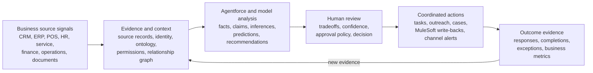
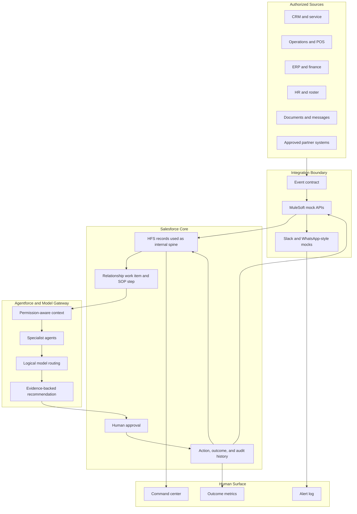

# System Architecture

## Product Mental Model

This branch turns authorized first-party business data into evidence-backed
decisions, coordinated relationship actions, and outcome feedback.

The key rule is simple: agents can recommend, explain, draft, and request
approval. Consequential external actions require the configured approval policy
and an auditable action boundary.

## Closed-Loop Flow

1. A source event arrives from an authorized business system or fixture.
2. The event contract validates the envelope, hash, idempotency key, sequence,
   and correlation ID.
3. The source payload maps into Salesforce context records for entities,
   relationships, evidence, work items, recommendations, approvals, actions, and
   outcomes.
4. Agentforce receives only the context the current user and purpose can access.
5. Specialist agents analyze the relevant relationship, operational, financial,
   service, supplier, staff, or customer context.
6. The orchestrator produces one evidence-backed recommendation or plan.
7. The responsible human approves, rejects, modifies, or defers protected
   actions.
8. MuleSoft mocks execute approved write-backs and channel alerts.
9. Outcome events return through the same intake path and refresh the command
   center and relationship state.

## Runtime Components

## Storage Responsibilities

| Component       | Responsibility                                                                   |
| --------------- | -------------------------------------------------------------------------------- |
| Source fixtures | Synthetic business records and event payloads                                    |
| MuleSoft mocks  | Intake, validation, write-back simulation, channel results, retry behavior       |
| Salesforce Core | Work item, evidence, recommendation, approval, action, outcome, and audit record |
| Model gateway   | Logical model profile, routing, validation, fallback, and invocation audit       |
| Agentforce      | Explanation, recommendation drafting, approval request, and governed refusal     |
| Lightning       | Command center, evidence timeline, approval cockpit, alert log, outcome view     |

## Current Repository State

The repo already contains a reusable governed spine: Salesforce metadata,
service contracts, event schemas, MuleSoft mocks, model-gateway fixtures,
Agentforce contracts, a Lightning command center, and harness scripts.

The next work is to keep that spine broad enough for relationship-management
intelligence while using the retail demo as one concrete vertical slice.
