# Closed-Loop Intelligence RM

This branch is centered on a permissioned enterprise intelligence and
relationship-management system.

The simple version: the product turns first-party business data into grounded
judgment, turns judgment into coordinated human action, records what happened,
and feeds the outcome back into the next cycle.

The CIA or Palantir analogy is useful only at the level of decision support:
authorized intelligence comes in, analysts and agents form conclusions, leaders
coordinate action, and outcomes update the operating picture. This product is
not a surveillance system, not a data-harvesting product, and not a covert
collection product. The MVP uses data the business already owns or is already
authorized to process.

## Core Loop

```mermaid
flowchart LR
    SOURCES["First-party proprietary data<br/>CRM, ERP, POS, HR, service, finance,<br/>operations, documents, messages, events"]
    INTAKE["Ingest and preserve<br/>validation, source record, hash,<br/>idempotency, access scope"]
    MAP["Semantic mapping<br/>identity, ontology, terminology,<br/>provenance, time"]
    INTEL["Intelligence<br/>facts, claims, inferences,<br/>predictions, attribution, uncertainty"]
    DECIDE["Decision support<br/>recommendations, tradeoffs,<br/>approval requirements, confidence"]
    COORD["Relationship coordination<br/>customers, staff, managers, suppliers,<br/>partners, regulators, shareholders"]
    ACTION["Approved action<br/>tasks, outreach, cases, workflows,<br/>MuleSoft write-backs, channel messages"]
    OUTCOME["Outcome evidence<br/>responses, completions, exceptions,<br/>business metrics, human feedback"]

    SOURCES --> INTAKE --> MAP --> INTEL --> DECIDE --> COORD --> ACTION --> OUTCOME
    OUTCOME -->|"new source evidence"| INTAKE
```

## What We Are Building

The product is a relationship-management intelligence loop, not merely a CRM
front end. It should work across every important business relationship:

- customers and prospects;
- employees, managers, recruiters, and internal teams;
- suppliers, distributors, contractors, and implementation partners;
- subsidiaries, franchisees, stores, branches, and operating units;
- regulators, auditors, shareholders, board members, and public stakeholders.

The system should help an organization answer:

- What is happening across fragmented systems?
- Which source evidence supports that picture?
- Which pieces are facts, claims, inferences, recommendations, decisions,
  actions, or outcomes?
- Which relationships are affected?
- What should be done next, by whom, through which channel, under which policy?
- What happened after the action, and did it improve the situation?

## Architecture Layers

### 1. Data and Provenance Layer

This layer preserves source records and makes fragmented data usable.

- Ingest events and records from Salesforce, Data 360, MuleSoft, files, APIs,
  and approved operational systems.
- Keep original source references, hashes, timestamps, system identifiers,
  user/purpose scope, and correlation IDs.
- Normalize only through versioned mappings. Do not destroy contradictory
  evidence or silently overwrite old claims.
- Track valid time, recorded time, source system, rule or model version, and
  generation time for every derived result.

### 2. Semantic and Ontology Layer

This layer lets the business use its own language without losing consistency.

- Map local terms into stable entity, relationship, event, action, and outcome
  types.
- Use OWL/SKOS/SHACL-style contracts for meaning and validation where they help.
- Keep workflow DAGs, semantic graphs, assertion histories, and decision traces
  connected but distinct.
- Support customer-specific terminology, SOPs, permissions, and operating
  structures.

### 3. Intelligence Layer

This layer creates the operating picture.

- Classify events and entities.
- Segment and score relationships using defined formulas and time windows.
- Attribute outcomes to touchpoints where evidence permits it.
- Generate predictions, explanations, and next-best-action recommendations.
- Separate deterministic rules from model-generated interpretations.
- Make model profiles hotswappable across Salesforce-managed, cloud, private
  cloud, and on-prem deployments.

### 4. Decision and Action Layer

This layer turns intelligence into coordinated work.

- Route recommendations to the right person, team, agent, or approval policy.
- Draft outreach and task instructions without bypassing approval rules.
- Coordinate Salesforce records, Agentforce actions, MuleSoft integrations,
  Slack-style alerts, WhatsApp-style alerts, email, cases, tasks, and SOP steps.
- Require human approval for protected external actions.
- Record the decision, action, actor, channel, payload hash, response, and
  outcome.

### 5. Feedback and Learning Layer

This layer closes the loop.

- Treat task completions, replies, denials, escalations, revenue changes,
  satisfaction changes, operational metrics, and exceptions as new evidence.
- Compare expected outcome against actual outcome.
- Update relationship state, confidence, and future recommendations.
- Feed authorized outcome data into offline evaluation and model/policy
  improvement, never silent production self-modification.

## Current Demo Vertical

The supermarket command-center work can remain as a useful demo vertical. It
should prove the loop with tangible records: product risk, supplier response,
staff task, manager approval, channel alert, and outcome.

But retail is not the branch north star. Retail is one scenario that exercises
the broader product architecture.

## Non-Goals

- Do not reduce the product to a supermarket-only operations tool.
- Do not pitch or implement covert surveillance, employee spying, scraping, or
  unauthorized personal-data harvesting.
- Do not treat LLM output as source truth.
- Do not execute protected external actions without policy and human approval.
- Do not hide uncertainty behind unexplained scores.
- Do not hard-code customer terminology, organizational structure, channels, or
  model providers.

## Branch Invariants

- First-party or explicitly authorized data only.
- Source records and provenance are preserved.
- Facts, claims, inferences, recommendations, decisions, actions, and outcomes
  remain distinct.
- Contradictions are superseded explicitly, not deleted silently.
- Every metric, score, confidence value, and time window is defined.
- Agents operate under the current user's permissions and purpose restrictions.
- Deterministic policy gates protect action execution.
- The retail demo can use product-specific labels, but shared contracts must
  remain relationship-management and decision-intelligence ready.
