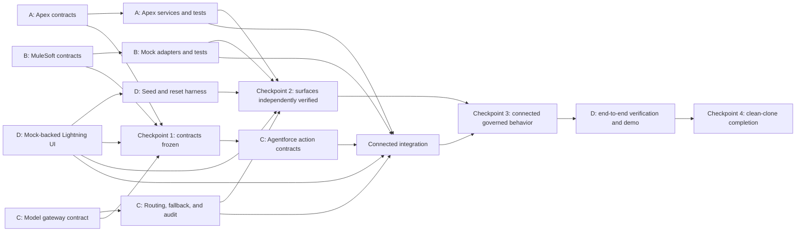

# Parallel Development Guide

## Purpose

The first vertical slice uses stable contracts so multiple contributors can
work without stepping on each other. Work should start from the relevant
contract, fixture, or checklist item, then move through verification before
handoff.

For the hackathon, the active vertical is North Star: a global operations
command center with a private hospital demo profile. Keep coordination focused
on the roadmap, teammate assignment docs, and existing contract boundaries.

Claim leaf beads only when Beads is installed. The `hfs-v1-05` through
`hfs-v1-10` feature beads are coordination containers and completion summaries.

Record active work by claiming the relevant bead when Beads is available:

```bash
bd update <bead-id> --claim
```

If Beads is not installed, name the `ROADMAP.md` checklist item being advanced.

## Checkpoints

### Checkpoint 1: Contracts Frozen

Bead: `hfs-v1-cp1`

Required:

- Apex service DTOs and authorization matrix;
- MuleSoft OpenAPI operations, errors, and callbacks;
- model gateway profiles, routing, invocation, and fallback contracts;
- versioned UI state fixtures.

After this checkpoint, incompatible interface changes require:

1. an explicit compatibility note on the changed bead or roadmap item;
2. review from every affected surface;
3. updated examples and contract tests in the same pull request.

### Checkpoint 2: Surfaces Independently Verified

Bead: `hfs-v1-cp2`

Each surface must run without unfinished downstream work:

- Apex services pass success and material failure tests;
- MuleSoft mocks pass contract, idempotency, retry, and callback tests;
- model routing switches providers and fails closed when none qualify;
- the Lightning experience renders the complete case from mocks;
- seed and reset commands work repeatedly.

### Checkpoint 3: Connected Governed Behavior

Bead: `hfs-v1-cp3`

The connected path must preserve:

- tenant and correlation identifiers;
- evidence and provenance;
- permission and purpose restrictions;
- model deployment and policy versions;
- human approval before protected action;
- action and outcome audit history;
- clinical-decision refusal for hospital demo requests.

### Checkpoint 4: Clean-Clone Completion

Bead: `hfs-v1-cp4`

A clean clone must reproduce the complete vertical slice and its material
failure paths without manual database edits.

## Dependency Flow



## Branch And Pull Request Rules

- Use one branch and pull request per leaf bead or roadmap item.
- Name branches with the repo prefix convention, usually `codex/<short-task>`.
- Keep pull requests focused on one contract, feature, or verification path.
- Contract pull requests contain schemas, examples, and validation before broad
  implementation.
- Consumers may use versioned fixtures and mocks before providers are complete.
- Contract changes need review from every affected surface.
- Merge or rebase current `main` before connected integration work.
- Close a leaf item only after its acceptance criteria pass and the pull
  request is merged.
- Close the coordination parent after all of its leaf items pass.

## File Collision Rules

Shared files need explicit coordination:

| Shared surface                   | Change rule                                                        |
| -------------------------------- | ------------------------------------------------------------------ |
| `package.json`, CI, manifests    | affected surfaces review                                           |
| core Salesforce object metadata  | Salesforce and every consuming surface review                      |
| event schemas and ontology       | contract owner plus every consuming surface reviews                |
| cross-surface DTO or error names | Checkpoint 1 compatibility process applies                         |
| `.beads/issues.jsonl`            | Sync immediately before commit; resolve by re-exporting from Beads |

## Coordination Commands

```bash
./scripts/team-status.sh
bd graph hfs-v1 --compact
bd ready
```

The status script is the quick coordination view. Beads remains authoritative
for claiming, dependencies, and completion when it is installed.
